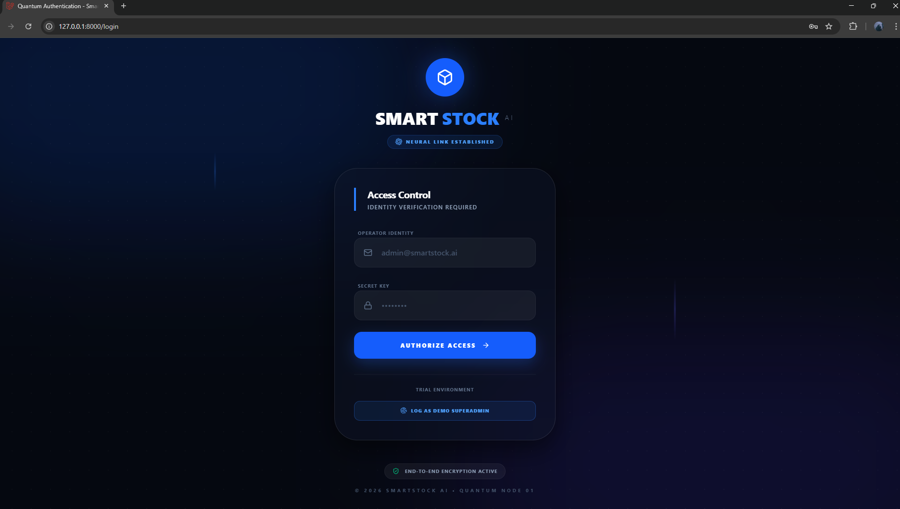
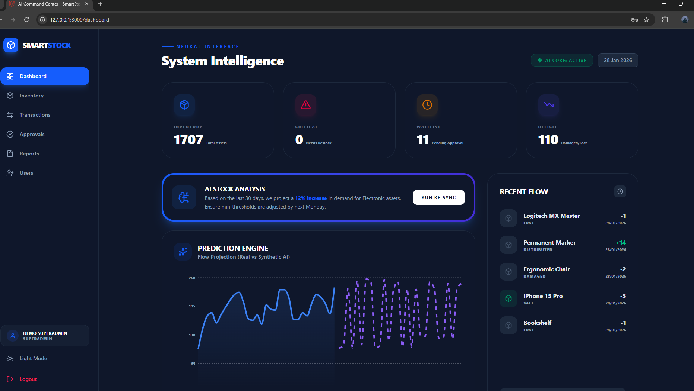
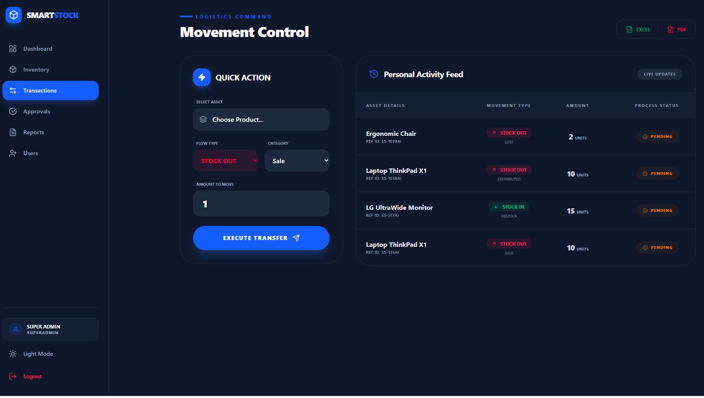
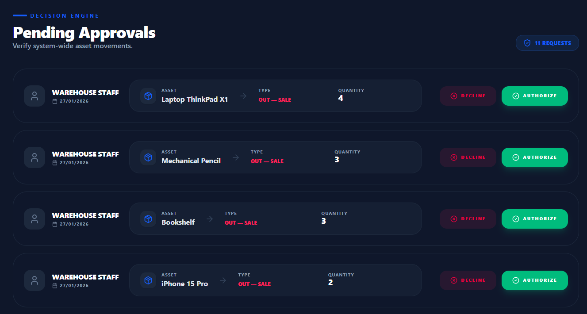
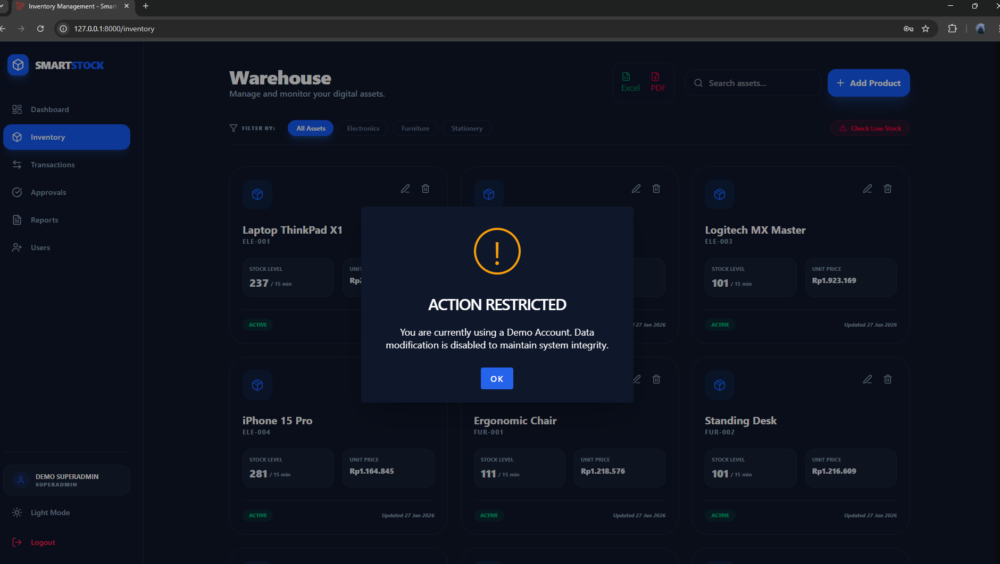

<div align="center">

# SᴍᴀʀᴛSᴛᴏᴄᴋ AI 🚀
### Next-Gen Inventory Management System with Advanced Analytics & Security



---

**SᴍᴀʀᴛSᴛᴏᴄᴋ AI** is a professional-grade warehouse and inventory management solution built for speed, security, and scalability. Featuring a sleek glassmorphism UI, role-based access control, and automated reporting systems.

[ [Demo Live: https://smartstock-ai.my.id](https://smartstock-ai.my.id) ]

</div>

---

## 💎 Features Highlight

* **Futuristic Dashboard**: Real-time analytics with interactive charts (Monthly/Weekly data).
* **Role-Based Access Control (RBAC)**: Distinct permissions for Superadmin, Admin, and Staff.
* **Automated Reporting**: Export professionally branded PDF & Excel reports.
* **Approval System**: Secure transaction flow requiring Admin/Superadmin verification.
* **Smart Inventory**: Full CRUD with categorized tracking and restock indicators.
* **Demo Mode Protection**: Secure trial environment with "Read-Only" middleware for portfolio visitors.
* **Neural Stock Forecasting**: Integrated Python Machine Learning engine using Exponential Smoothing to predict restock dates based on real-time burn rates.
* **Intelligent Insights**: Dynamic AI-generated briefings that analyze demand trends (increment/decrement percentages) and provide adaptive urgency alerts.

---

## 🧠 AI Integration Architecture

The system uses a **Modern Hybrid Architecture**:
1. **Laravel** serves as the core orchestrator and data gatekeeper.
2. **Python Venv** acts as the isolated analytical brain.
3. Data is synchronized via **direct PostgreSQL connection** for high-performance processing.
4. Insights are delivered back to the **React frontend** using Inertia.js for a seamless SPA experience.

---

## 🔐 Access Control Matrix (RBAC)

The system implements a strict Role-Based Access Control to ensure data integrity and operational security.

| Feature | Superadmin | Admin | Staff |
| :--- | :---: | :---: | :---: |
| **User Management** (Add/Edit/Delete User) | ✅ | ❌ | ❌ |
| **System Reports** (Financial & Analytical) | ✅ | ❌ | ❌ |
| **Transaction Approvals** | ✅ | ✅ | ❌ |
| **Inventory Management** (Add/Edit Stock) | ✅ | ✅ | ⚠️ (Read Only) |
| **Create Transactions** | ✅ | ✅ | ✅ |
| **View Dashboard** | ✅ | ✅ | ✅ |

### Roles Definition:
* **Superadmin**: The "Command Center" user. Has full authority over the system, including managing users and high-level financial reports.
* **Admin**: The "Operations Manager". Focused on inventory flow and approving staff transactions but cannot touch user management.
* **Staff**: The "Ground Operator". Limited to creating transaction requests and monitoring stock levels without the ability to modify core data or approve requests.

---

## 🛠️ Detailed Tech Stack

| Category | Technology | Purpose |
| :--- | :--- | :--- |
| **Backend Core** | **Laravel 11** | Leveraging the latest PHP framework for robust API routing, middleware security, and server-side logic. |
| **Frontend Library** | **React.js** | Building a reactive and component-based user interface for a modern web experience. |
| **Architecture** | **Inertia.js** | Serving as the "Modern Monolith" bridge to build Single Page Applications (SPA) without the complexity of a separate API. |
| **Styling** | **Tailwind CSS** | Implementing a high-fidelity glassmorphism design system and responsive utility-first layouts. |
| **Database** | **PostgreSQL** | Managing relational data with robust performance for concurrent analytical queries. |
| **AI Engine** | **Python 3.12+** | Processing complex statistical models and time-series forecasting outside the PHP runtime. |
| **Machine Learning** | **Statsmodels & Pandas** | Implementing Simple Exponential Smoothing (SES) for reliable inventory projection. |
| **Build Tool** | **Vite** | Orchestrating lightning-fast Hot Module Replacement (HMR) and optimized production bundling. |
| **UI Components** | **Lucide React** | Providing consistent, high-quality icons for a futuristic and clean navigation system. |
| **Notifications** | **SweetAlert2** | Delivering professional, themed modal alerts and toast notifications for user feedback. |
| **Export Engines** | **Maatwebsite Excel** | Handling complex data transformations for professional PDF and XLSX report generation. |


---

## 🛡️ Portfolio Demo Mode

To ensure system integrity while allowing recruiters to explore, this project includes a **Restricted Demo Mode**:

* **Demo Account**: `superadmin@demo.com` / `password123`
* **Protection**: Attempts to modify data (Create/Update/Delete) via the demo account are intercepted by a custom `PreventDemoModify` middleware.
* **Feedback**: Users receive a professional SweetAlert2 notification explaining the restriction.

---

## 📸 Screenshots Gallery

### 🖥️ Secure Login Interface
*Futuristic login with glassmorphism effects and scan animation.*


### 📊 Real-time Dashboard (System Intelligence)
*Overview of stock levels, recent transactions, and neural stock analysis.*


### 📦 Warehouse & Inventory Control
*Centralized management for digital assets with real-time stock monitoring.*


### ⚡ Movement Control & Approvals
*Logistics command center for asset movement and multi-level approval system.*
 

### 🛡️ Secure Demo Experience
*Custom middleware protection for portfolio trial accounts.*


---

## 🚀 Installation

Follow these steps to set up the project locally:

1.  **Clone the Repository**
    ```bash
    git clone [https://github.com/yourusername/smartstock-ai.git](https://github.com/yourusername/smartstock-ai.git)
    cd smartstock-ai
    ```

2.  **Backend Setup**
    ```bash
    composer install
    cp .env.example .env
    php artisan key:generate
    ```

3.  **Database Configuration**
    Set up your `.env` database details, then run:
    ```bash
    php artisan migrate --seed
    ```

4.  **Frontend Setup**
    ```bash
    npm install
    npm run dev
    ```

5. **AI Engine Setup**
    ```bash
    python -m venv venv
    # Windows:
    ai_venv\Scripts\activate
    # Linux/Mac:
    source ai_venv/bin/activate

    pip install pandas statsmodels sqlalchemy psycopg2-binary mysql-connector-python
    ```

---